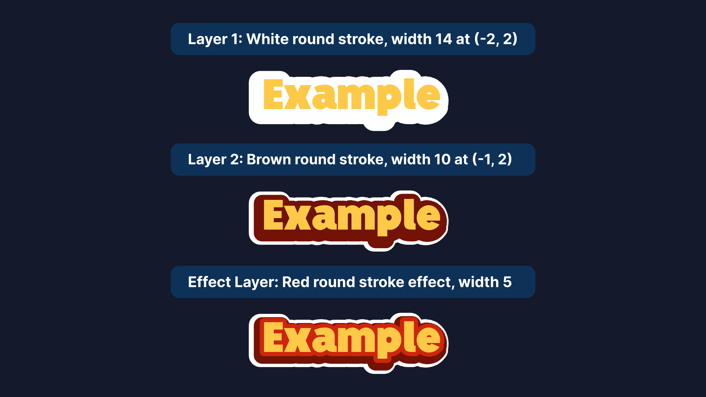

# 🖋️ FontStory Text Style Format

This project supports **layered, configurable text effects** defined entirely through JSON. Without writing any Dart code, you can create complex visual styles (e.g. shadows, outlines, colorful layers) that are rendered inside the Flutter app.

---

## 🧰 Overview

Each style entry in the JSON defines how text should look by using a combination of:

- `baseTextStyle`: editable main text
- `effectStyle`: stylized visual effect (e.g. stroke, underline)
- `layeredTextStyles`: stacked background layers with custom positioning

These layers are combined visually to create rich and dynamic text effects.

---

## 🧱 JSON Schema

```json
{
  "name": "unique-style-name",
  "thumbnail": "/styles/unique-style.png",
  "defaultTextColor": "#FF00FF",
  "defaultStyleColor": "#000000",
  "canChangeColor": true,
  "baseTextStyle": { ... },
  "effectStyle": { ... },
  "layeredTextStyles": [ ... ]
}
```

### 📌 Field Descriptions

| Key                 | Description                                  | Required            |
| ------------------- | -------------------------------------------- | ------------------- |
| `name`              | Unique identifier for the style              | ✅ Yes              |
| `thumbnail`         | Path to preview image                        | ✅ Yes              |
| `defaultTextColor`  | Default foreground text color                | Optional            |
| `defaultStyleColor` | Default color for effect/outline             | Optional            |
| `canChangeColor`    | If true, user can customize effect color     | Optional            |
| `baseTextStyle`     | Style for the editable text layer            | At least one required (baseTextStyle, effectStyle, or layeredTextStyles) |
| `effectStyle`       | Main visual effect like stroke/underline     | At least one required (baseTextStyle, effectStyle, or layeredTextStyles) |
| `layeredTextStyles` | List of background layers for depth/shadow   | At least one required (baseTextStyle, effectStyle, or layeredTextStyles) |

> Note: At least one of baseTextStyle, effectStyle, or layeredTextStyles must be provided.
---

## 🎨 Style Layer Types

### 1. `baseTextStyle`

User-editable layer. Can include color, shadows, spacing, etc.

```json
"baseTextStyle": {
  "shadows": [
    { "color": "#000000", "blurRadius": 6, "offsetX": 2, "offsetY": 3 }
  ]
}
```

---

### 2. `effectStyle`

Visual effects like stroke, fill, or text decoration.

```json
"effectStyle": {
  "paint": {
    "paintStyle": "stroke",
    "strokeWidth": 5,
    "strokeJoin": "round",
    "color": "#522196"
  }
}
```

Or underline decoration:

```json
"effectStyle": {
  "decoration": "underline",
  "decorationStyle": "solid",
  "decorationThickness": 10
}
```

---

### 3. `layeredTextStyles`

Stacked background text layers to create colorful depth, neon effects, or multi-shadowed text.

Each entry contains:

- A `paint` style (fill or stroke)
- A relative `position` offset (in `x`/`y`, scaled by font size)

```json
"layeredTextStyles": [
  {
    "style": {
      "paint": {
        "paintStyle": "stroke",
        "strokeWidth": 10,
        "color": "#FFFFFF"
      }
    },
    "position": { "x": -2, "y": 2 }
  }
]
```

---

## 🛠 Example: Rainbow Shadow

```json
{
  "name": "rainbow-glow",
  "thumbnail": "/styles/rainbow.png",
  "defaultTextColor": "#FFFFFF",
  "layeredTextStyles": [
    {
      "style": { "paint": { "paintStyle": "fill", "color": "#FF0000" } },
      "position": { "x": -3, "y": 3 }
    },
    {
      "style": { "paint": { "paintStyle": "fill", "color": "#00FF00" } },
      "position": { "x": -2, "y": 2 }
    },
    {
      "style": { "paint": { "paintStyle": "fill", "color": "#0000FF" } },
      "position": { "x": -1, "y": 1 }
    }
  ]
}
```

---

## 📐 Visual Diagram of Layer Stack

Each text field consists of a visual stack like this:



Larger stroke widths and positive Y-offsets push shadows behind the main text.

---

## ✅ Tips & Best Practices

- Use `fill` for colored backgrounds or shadows
- Use `stroke` for outlines
- Layer order matters: add deepest shadow first
- `strokeWidth` values are scaled by font size internally
- Provide a matching thumbnail preview for each style

---

## 🧪 Want to create your own?

1. Copy an existing style JSON entry
2. Adjust colors, stroke widths, positions
3. Save it in your JSON file
4. Add a matching thumbnail preview in the `styles/` folder

That’s it — your style will be available inside the app!

---

## 🖋️ Adding Custom Fonts

Easily add your custom fonts by following these steps:

1. Add your font files (`.ttf` or `.otf`) to the `fonts/{language}/` folder.  
   Example:  

  ```
  fonts/persian/your-font.ttf
  fonts/english/your-font.otf
  ```

2. Register the font in `fonts.json` with its name and file path.

3. Submit a Pull Request to include your fonts in the project.

> **Note:** Make sure you have proper licensing to share the fonts (either your own or open-license fonts).

---

Feel free to contribute styles or raise issues via GitHub ✨